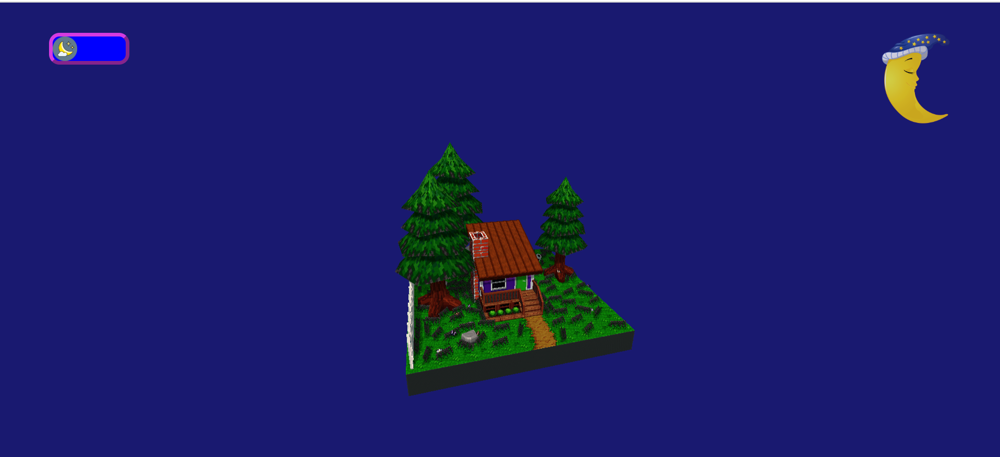
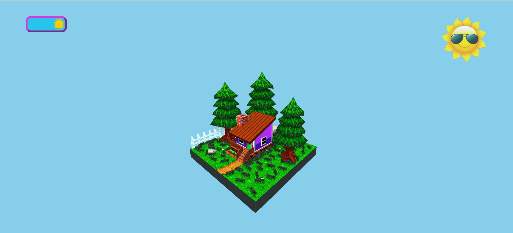
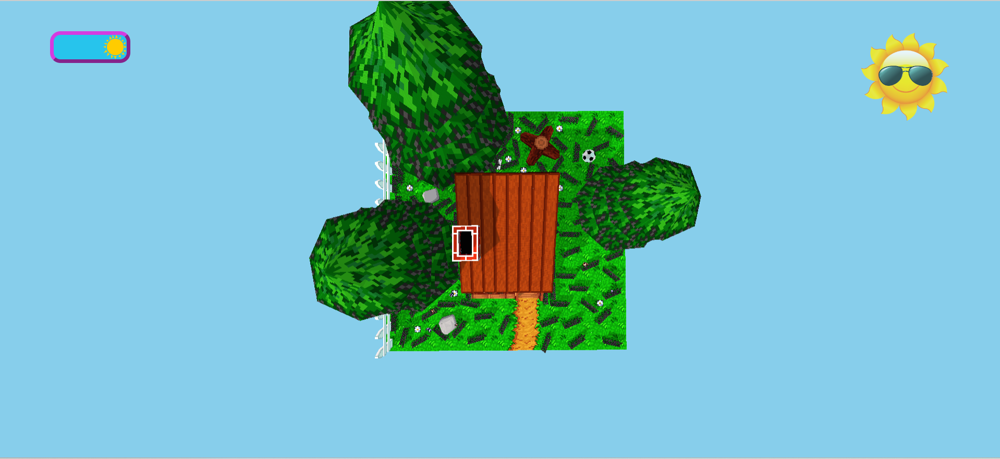
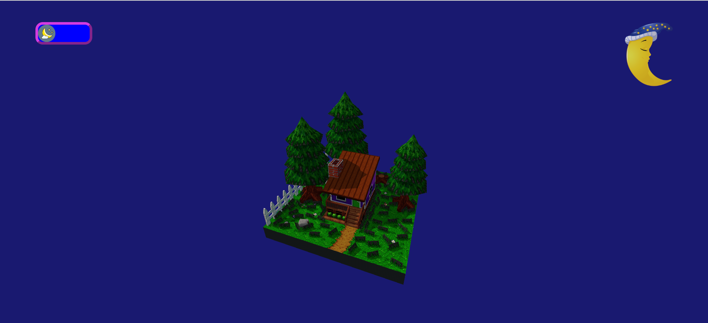
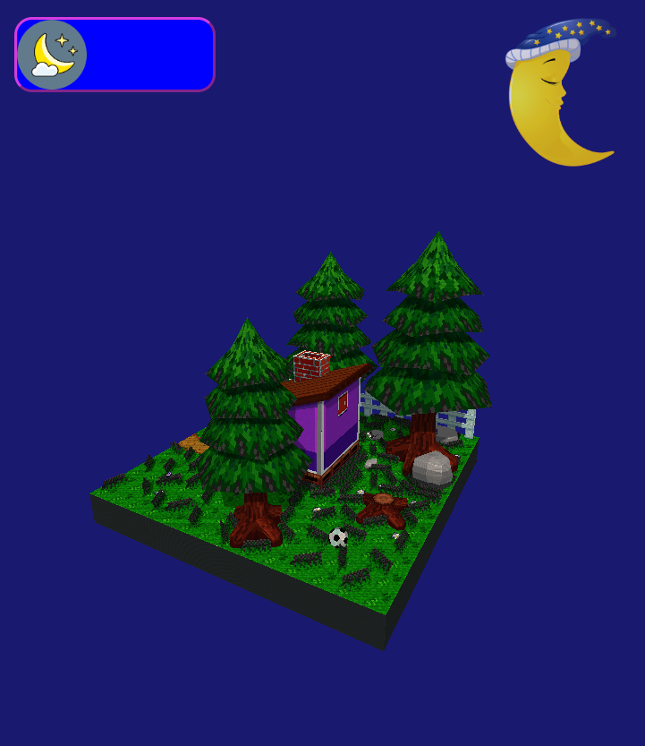
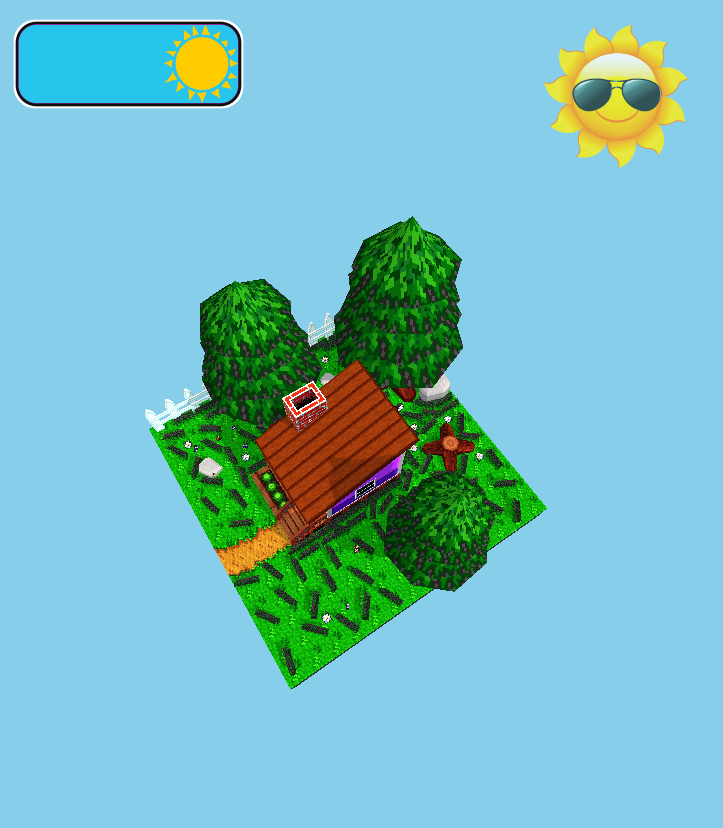

# 3D Forest House Project

Welcome to the 3D Forest House project repository! This project showcases a 3D model of a forest house rendered using Three.js.

## Project Overview

The goal of this project is to create a visually appealing 3D representation of a forest house environment using WebGL technology. The project utilizes the following components:

- **Three.js**: A JavaScript library for creating and rendering 3D graphics in a web browser.
- **GLTFLoader**: A Three.js loader used to load 3D models in the GLTF (GL Transmission Format) format.
- **Ambient Lighting**: Implementation of ambient and directional lighting to enhance the visual quality of the scene.

## Preview








<video width="400" controls style="border-radius: 0.5em;">
  <source src="Output/output.mp4" type="video/mp4">
  Your browser does not support the video tag.
</video>

## Features
- 3D model loading and configuring
- AmbientLight and DirectionalLight simulating sunlight for casting shadows
- Event listeners for window resizing, mouse movement, and keyboard input
- Rotates the 3D model around the y-axis to add animation
- User interaction based on cursor movement
- Day/Night mode
- Error handling
- Responsive design

## Link to the model
https://sketchfab.com/3d-models/forest-house-5646e6a3c8834022a0e289465f0bbc5d

## Getting Started

To run this project locally, follow these steps:

1. **Clone Repository:**

   ```bash
   git clone https://github.com/Krisha1703/3D-Forest-House.git
   
2. Open the index.html with Live Server (or local development server).
